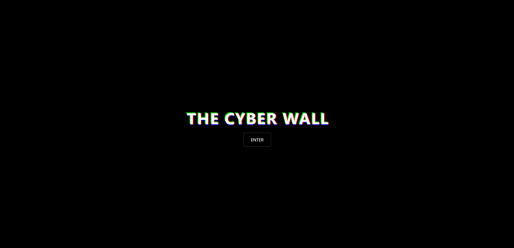

  

<h1 align="center">🌐 The Cyber Wall</h1>

  <a href="https://www.thecyberwall.eu/" target="_blank">🔗 Visit the website</a>

---

## 📖 About
**The Cyber Wall** is a curated collection of useful links, repositories, and resources focused on **cybersecurity, OSINT, programming, and technical knowledge**.  
It’s designed as a central hub to quickly access tools and information in one place.

---

## 🔎 What You’ll Find
- 🛡️ Security and cybersecurity tools  
- 📂 GitHub repositories with practical projects  
- 🌍 Reference websites and platforms  
- 📚 Learning resources for self-improvement  
- 🏗️ Useful repositories and links for **engineers**  
- ➕ And much more, constantly updated!  

---

## 🚀 Mission
To provide a single, accessible wall of knowledge where professionals, students, engineers, and enthusiasts can easily discover, use, and share the best resources in the tech and security fields.

---

## 🤝 Contribute
Do you know a resource that should be on **The Cyber Wall**?  
Feel free to open a pull request or contact me with suggestions!

---

## 📫 Contact
- 🌐 Website: [thecyberwall.eu](https://www.thecyberwall.eu)  
- 💡 GitHub: [@Dtype1](https://github.com/Dtype1)
